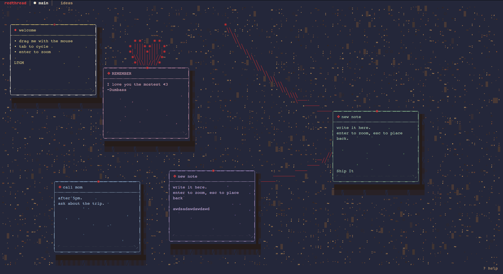

# redthread

A sticky-note pegboard for your terminal. Mouse-first, keyboard-friendly,
transparent over your tmux theme. ASCII-textured cork, dangling red
strings, smooth zoom, and multiple named boards you can switch between.



---

## What it is

- A small TUI meant to live in a tmux pane, always open.
- A cork pegboard rendered entirely in ASCII — your terminal background
  shows through, no solid fill.
- Sticky notes you drag with the mouse or nudge with the keyboard.
  Colored paper, red pin, ornate woven borders, paper-fiber flecks,
  drop shadow, fold glyph.
- **Red strings** between notes (or pinned to bare cork). Slack or
  tight. In-front-of or behind the notes. A weighted "swoop" while you
  pull the free end.
- **Multiple named boards** you cycle through like tmux windows
  (`work`, `personal`, `ideas`, …). Each board has its own notes,
  strings, zoom, font, highlight color, and a unique cork grain.
- **Workspace zoom** — 5 levels (`-3..+1`) that scale note sizes *and*
  positions, so you can pack many stickies into an overview or lean in
  on a few.
- **3D zoom-to-edit** — a smooth scale + lift + shadow animation that
  settles into a card with a live textarea.
- **9 paper tints + 9 highlight colors + 9 text styles** (Unicode math
  alphabets: plain, bold, italic, script, fraktur, double-struck,
  monospace, fullwidth, and bold-italic).
- Persists to `$XDG_DATA_HOME/redthread/notes.json` with debounced writes.

## Install

Requires **Go 1.23+**.

```bash
git clone https://github.com/B33pBeeps/redthread.git
cd redthread
go build -o redthread ./cmd/redthread
./redthread
```

Or:

```bash
go install github.com/B33pBeeps/redthread/cmd/redthread@latest
redthread
```

First run with no save file gets a small demo board. `redthread --fresh`
ignores the save and reseeds.

## Controls

### Mouse

| | |
|---|---|
| click a note | select + raise |
| drag | move (drops with a bounce) |
| double-click | zoom-to-edit |
| click empty cork while pulling a string | place a wall-pin |

### Keyboard — board

| key | action |
|---|---|
| `tab` / `shift+tab` | cycle note selection |
| `← ↑ ↓ →` or `hjkl` | nudge (overshoots in motion direction) |
| `shift + ← ↑ ↓ →` | nudge ×5 |
| `enter` | zoom-to-edit |
| `n` / `d` / `r` | new / delete / raise note |
| `1` – `9` | tint the selected note (yellow, pink, blue, green, purple, orange, teal, cream, coral) |
| `c` | cycle the global highlight (border) color |
| `a` | open the font menu (live preview, enter to commit, esc to cancel) |
| `-` / `=` / `0` | zoom out / in / reset (5 levels) |
| `s` | start pulling a red string from the selected note's pin |
| `[` / `]` | cycle the hovered string |
| `t` | toggle tight / slack on the hovered string |
| `f` | toggle in-front-of / behind notes |
| `x` | cut the hovered string |
| `X` | cut every string on the selected note |
| `?` | toggle the help panel (slides up from the bottom) |
| `q` / `ctrl+c` | quit (saves) |

### Keyboard — boards

| key | action |
|---|---|
| `>` (or `.`) | next board |
| `<` (or `,`) | previous board |
| `B` | new board (drops you into rename) |
| `R` | rename the active board |
| `D` | delete the active board (press twice within 2s; refuses if it's the last one) |

### Keyboard — edit

| key | action |
|---|---|
| typing | edit body (first non-empty line is the title) |
| `esc` | close + save with reverse transition |
| `ctrl+s` | save without closing |

## Data

Notes live at `$XDG_DATA_HOME/redthread/notes.json`, defaulting to
`~/.local/share/redthread/notes.json`. Writes are debounced (400 ms) so
rapid drags coalesce into one flush.

A legacy `brainfartadhdfixerupper/` directory auto-migrates on first
launch under the new name. v3 single-board files migrate forward into
the v4 workspace envelope.

Schema (v4):

```json
{
  "schemaVersion": 4,
  "activeIdx": 0,
  "boards": [
    {
      "name": "main",
      "grainSeed": 1777118907643042768,
      "zoom": 0,
      "textMode": 0,
      "highlightColor": 0,
      "notes":   [ { "id": "…", "title": "…", "body": "…",
                     "x": 3, "y": 1, "tint": "yellow",
                     "created": "…", "updated": "…" } ],
      "strings": [ { "a": { "note": "idA" }, "b": { "note": "idB" },
                     "tight": false, "front": false } ]
    }
  ]
}
```

## Customizing

Color palettes and text styles live in `internal/app/theme.go`:

- `Tints` + `TintOrder` — the 9 paper colors.
- `SelBorderChoices` — the 9 highlight colors.
- `TextModes` — the Unicode-alphabet font options.
- `StarChars` / `PoreChars` / `BlotchChars` — cork-texture char pools.

Edit any of those, rebuild, and the whole app picks up the new values
(help panel + menu + cycle included).

## File layout

```
cmd/redthread/
  main.go           thin entry — calls internal/app.Run()

internal/app/
  app.go            Run(): flag parsing, load/seed workspace, launch
  model.go          MVU (Model/Update/View, key + mouse routing,
                    tab bar, help panel, rename mode)
  notes.go          Note, Board, Workspace, StringConn, cork gen
  draw.go           cork + note rendering (shadow, tape, borders,
                    text, fibers)
  wire.go           red-string curve rendering + pull physics
  render.go         cell grid + coalesced ANSI emitter (transparent bg)
  theme.go          colors, tints, dither, halftone, text styles
  anim.go           zoom transition timeline + easings
  edit.go           canvas-drawn edit frame + bubbles/textarea splice
  menu.go           font-picker popup
  storage.go        XDG JSON persistence + v3→v4 migration

docs/
  screenshot.png

DESIGN.md           early design notes (historical)
```

## License

Personal project. MIT — use it, fork it, do whatever.
